# "Recognition" Design:

The purpose of this work is to demonstrate few state of art computer vision applications like Gesture, Emotions, Posture and Face Recognitions using popular computer vision open source libraries OpenPose/DLIB.

*Acknowledgement:*  
*This work is greatly inspired and have used code, concepts from libraries like OpenPose, DLIB, Kerasify and OpenCV.*

## 1) Introduction:  

The **recognition** application design and code is rightly integrated into OpenPose C++/Multithreaded framework. Fig(1) shows software architecture. Gesture, Emotions and Posture recognition is built based on OpenPose hand, face and pose libraries respectively. While Face recognition is built based on DLIB computer vision libraries.

Fig(1): Software Architecture:      
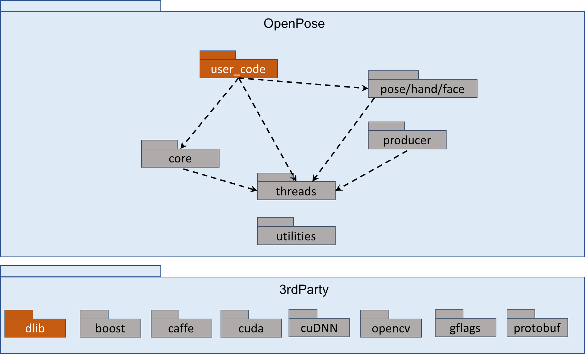  
Modules in orange are newly added/integrated for "recognition". Grey modules are of native OpenPose.

### 1.1) OpenPose Architecture:  
Architecture in Fig(1.1) shows two-branch multi-stage CNN. Each stage in the first branch predicts confidence map S^t, and each stage in the second branch predicts PAFs(Part Affinity Fields) L^t. After each stage, the prediction form the two branches, along with the image features, are concatenated for next stage.   

Fig(1.1): OpenPose Architecture [1]    
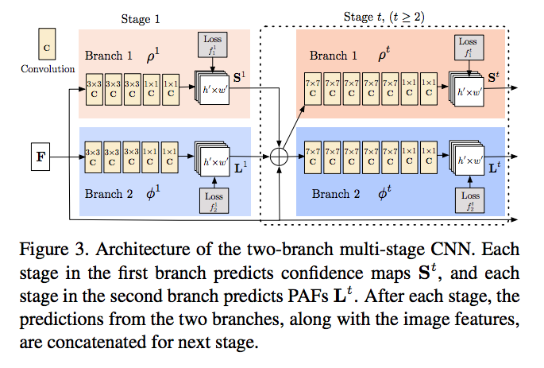   

## 2) Classifier:

A Time Distributed Feed Forward (Dense) neural network with LSTM classifier is used to classify openpose samples. Fig(1a) shows Keras Classifier Model. The model is trained with various 2D keypoints estimates with certain distance metric.

Consider a batch of 32 samples, where each sample is a sequence of 5 vectors of 36 dimensions. The batch input shape of the layer is then (32, 5, 36), and the input_shape, not including the samples dimension, is  (5, 36). Fig(1a) depicts network for posture(pose) with sample vector dimension of 36. Details of sample vector and distance metric are explained in below sections.  

Fig(2): Keras Classifier Model   
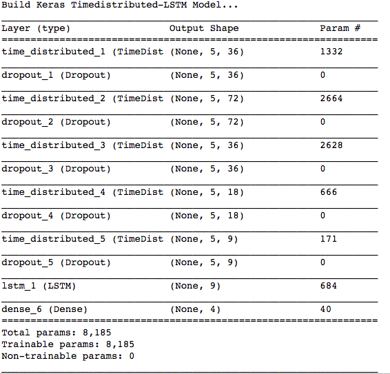

### 2.1) Prediction:  

Predictions are done for every time distributed sample in "recognition" software using Kerasify [4]    

## 3) OpenPose:  
A realtime multi-person skeletal 2D pose estimation deep neural network that locates anatomical keypoints for each person body parts such as limbs, hand, leg etc. using part affinity fields. Details of their design and research can be found [here](https://arxiv.org/pdf/1611.08050.pdf).  

### 3.1) Gesture Recognition:  
OpenPose **Hand Keypoints** illustrated in Fig(3.1) is used to classify different human hand gestures like victory, wave, stop, fist etc. The **recognition** application constructs a sample vector using cosine distance measured from reference keypoint (0: wrist) to all other hand keypoints as show in the Fig(3.1). This distance metric allows us to uniquely classify different gestures.  

Fig(3.1): OpenPose Hand Keypoints [2]  
   

Here are few hand keypoints rendered test samples with prediction and its confidence score.   

Fig(3.1a): Victory   
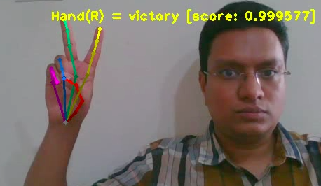  

Fig(3.1b): Stop   
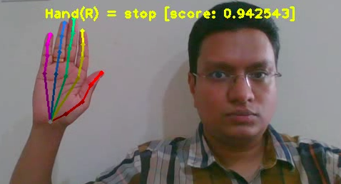   

Fig(3.1c): ThumbsUP   
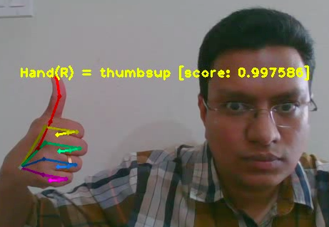    

Fig(3.1d): Pinch   
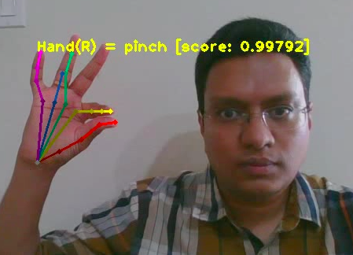   

#### 3.1.1) Gesture classifier training:
**Model parameters:**  
epochs      = 1000  
timesteps   = 5    
batch_size  = 32  
dropout     = 0.1  
activation  ='relu'  
optimizer   ='Adam'   
vector_dim  = 40    

**Confusion Matrix and Validation Accuracy:**  
Validation Accuracy: 97%  
Number of samples: < 600  

Fig(3.1.1) Hand Gesture Training Results   
  

### 3.2) Emotions Recognition:  
OpenPose **Face Keypoints** illustrated in Fig(3.2) is used to classify different human face emotions like sad, happy, surprise and normal. The **recognition** application constructs a sample vector using both l2 and cosine distance measured from reference keypoint (30: tip of nose) to all other face keypoints as show in Fig(3.2). To reduce the high dimensionality of vector space and better classify keypoints 0 thru 16 (chin and jaw) are ignored. Combining both distance metrics allows us to uniquely classify different face emotions.  

Fig(3.2): OpenPose Face Keypoints [2]   
   

Here are few face emotions rendered test samples with prediction and its confidence score.  

Fig(3.2a): Sad   
  

Fig(3.2b): Happy   
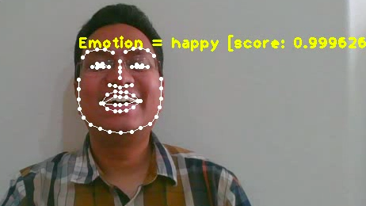  

Fig(3.2c): Surprise  
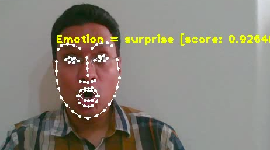   

Fig(3.2d): Normal  
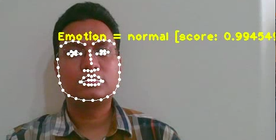  

#### 3.2.1) Emotions classifier training:
**Model parameters:**  
epochs      = 1000  
timesteps   = 5    
batch_size  = 32  
dropout     = 0.1  
activation  ='tanh'  
optimizer   ='Adadelta'   
vector_dim  = 96    

**Confusion Matrix and Validation Accuracy:**  
Validation Accuracy: 96%   
Number of samples: < 500   

Fig(3.2.1) Face Emotions Training Results  
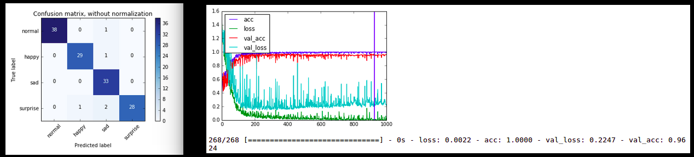   

### 3.3) Posture Recognition:  
OpenPose **Pose Keypoints** illustrated in Fig(3.3) is used to classify different human pose (posture) like sitting, standing and close_to_camera. The **recognition** application constructs a sample vector using l2 distance measured from reference keypoint (0: neck) to all other pose keypoints as show in Fig(3.3). This distance metric allows us to uniquely classify different human posture.  

Fig(3.3): OpenPose Pose Keypoints [2]   
    

Here are few pose rendered test samples with prediction and its confidence score.  

Fig(3.3a): Sitting  
  

Fig(3.3b): Standing  
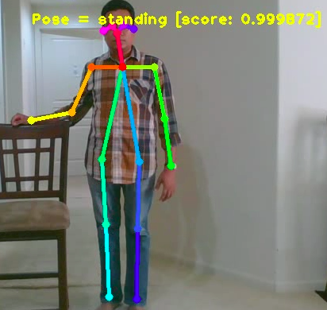  

Fig(3.3c): Close_to_camera  
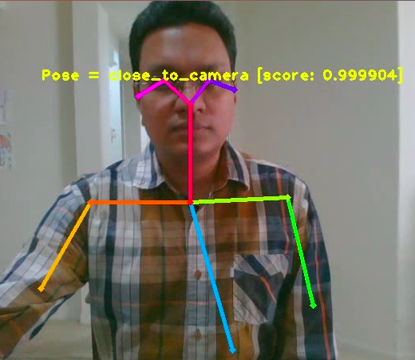   

#### 3.3.1) Posture classifier training:
**Model parameters:**  
epochs      = 1000  
timesteps   = 5    
batch_size  = 32  
dropout     = 0.1  
activation  ='relu'  
optimizer   ='Adam'   
vector_dim  = 36    

**Confusion Matrix and Validation Accuracy:**  
Validation Accuracy: 98%  
Number of samples: < 400   

Fig(3.2.1) Pose Training Results  
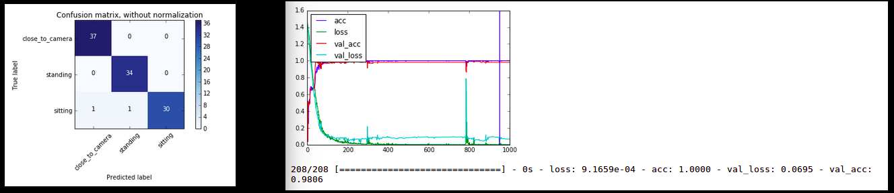  

## 4) DLIB:
A modern C++ toolkit containing deep learning algorithms and tools for creating computer vision software. Details of DLIB library and supported features can be found [here](https://github.com/davisking/dlib).  

### 4.1) Face Recognition:  
Face rectangle detected from OpenPose face keypoints is used for DLIB face recognition. Our observation found OpenPose face detection is much faster as its CNN than DLIB HOG based detection models.

Following steps are applied to recognize/train faces:  
1) With ROI of face rectangle identify 68 facial landmarks using DLIB shape detector. These landmarks are in same positions as OpenPose, except for two addition of landmarks (left and right) eye balls. The iBUG 300-W face landmark annotation scheme is followed.  

2) Affine transformation: Face will be rotated upright, centered, and scaled.  

3) Call DNN (ResNet based) to convert each face image in faces into a 128D vector. These 128D vector is unique to each face.

## 5) Limitations:

### 5.1) OpenPose Recognitions:
- Samples are trained with one person for this proof of concept and modeled accordingly. The respective samples and Keras model can be found in train_data folder. Though limited testing was done with more than one person.  

- Since the classifier design is based on distance metric it would make more sense to have training data sampled from multiple people with different hand, body and face features.  

### 5.2) DLIB Face Recognition:
- Our experiments found ResNet DNN model works fine for most cases, but unable to recognize face when it is completely turned right or left, pointing upwards or downwards.  

## 6) Reference:
[[1]](https://arxiv.org/pdf/1611.08050.pdf) Realtime Multi-Person 2D Pose Estimation using Part Affinity Fields  
[[2]](https://github.com/CMU-Perceptual-Computing-Lab/openpose/blob/master/doc/output.md) OpenPose: A Real-Time Multi-Person Keypoint Detection And Multi-Threading C++ Library  
[[3]](https://github.com/davisking/dlib) DLIB: A toolkit for making real world machine learning and data analysis applications in C++  
[[4]](https://github.com/moof2k/kerasify) Small library for running Keras models from a C++ application  
